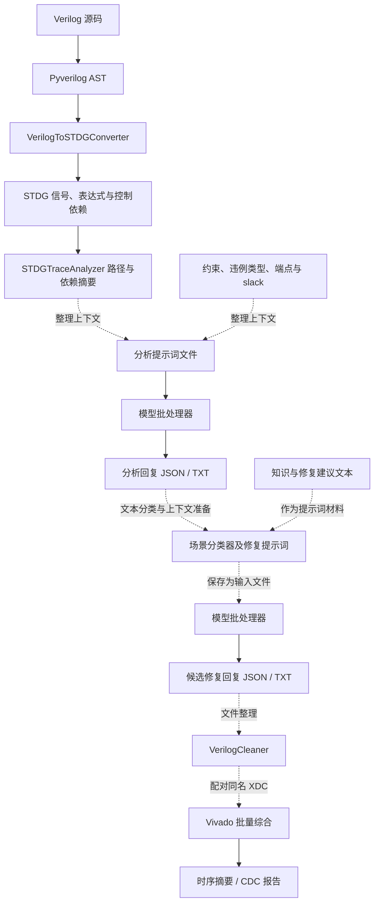

# tv-guider 代码探索记录

探索日期：2026-09-24。范围：当前工作目录中的实现、实验输入输出与架构草图。主要使用 CodeGraph v1.6.0 查询源码、符号和依赖关系，补充读取未被索引的提示词、Vivado 报告及 Mermaid 文件。

归档更新（2026-09-24）：原业务代码和实验数据已整体移入根目录的 `legacy/`。本文描述的是旧版实现；正文中的业务短路径均以 `legacy/` 为基准，源码链接和下方查询命令已更新。`docs/notes`、`.codegraph` 和 `.idea` 保留在项目根目录。

## 1. 项目做什么

这是一个面向 **Verilog RTL 时序违例分析与大模型辅助修复的研究原型及实验工作区**。它围绕建立时间（setup）、保持时间（hold）和跨时钟域（CDC）问题，提供以下几组能力：

1. 将 Verilog AST 转成信号、表达式与控制条件组成的 STDG 依赖图，回溯到指定信号的数据流路径。
2. 将 RTL、设计约束、路径、违例信息、原因描述和修复建议组织成大模型提示词；通过规则识别违例场景。
3. 批量调用 GPT、DeepSeek、Claude，保存多次采样的回复及 token 等信息。
4. 清理模型回复中的 Verilog，配合 XDC 约束调用 Vivado，生成综合后时序或 CDC 报告。

目前实现以独立脚本和磁盘文件串接各阶段，尚未发现统一的端到端控制器。`rag`、`repair` 只有空的初始化文件，注入器也未完成。已有实验产物能证明这些阶段曾被使用，不能单凭文件存在认定修复正确或自动闭环已经实现。

## 2. 两种“代码图”需要区分

本次使用的 **CodeGraph** 是辅助阅读项目 Python 等源码的索引工具；项目自身实现的 **STDG** 则是面向被分析 Verilog 的图数据结构。前者的调用关系不等于后者的 RTL 数据依赖。

本次索引状态为 `complete`，无待同步变更，包含 79 个文件、1,698 个节点、5,724 条关系，语言为 Python、JavaScript、XML。项目中实际有 61 个 Python 文件；索引还包含 `exports/.render-profile` 下的浏览器扩展脚本，因此总节点数不能当作核心业务代码规模。查询时使用精确路径，避免通用名称匹配到浏览器文件或历史副本。

本次索引没有包含 Verilog `.v` 文件，也没有覆盖 `.xdc`、提示词 `.txt` 和报告内容。跨文件关系存在名称匹配歧义；实现判断以返回的源码为依据，缺少图上调用边本身不构成“功能不存在”的证明。

## 3. 实际模块地图

| 位置 | 主要职责 | 当前状态 |
| --- | --- | --- |
| `analysis/stdg.py` | STDG 节点、边、违例记录、路径枚举 | 核心图模型已实现 |
| `analysis/ast2stdg.py` | Pyverilog AST 到 STDG 的转换 | 有实现，存在建模限制，解析链路本次未运行 |
| `analysis/path_analysis.py` | 反向数据流搜索、最长/最短路径、依赖摘要 | 已实现，带内嵌示例 |
| `analysis/pre_path_analysis.py`、`analysis/old*` | 相近实现、历史探索版本 | 阅读主线时需区分副本 |
| `prompt_generator` | 提示词模板及 setup/hold/CDC 文本场景分类 | 已实现，可独立调用 |
| `test`、`test_0618` | 模型调用脚本、提示词和模型输出 | 主要是批量实验驱动，不是统一自动化测试套件 |
| `test_0618/ablation` | 消融实验输入与结果 | 数据按目录保存 |
| `test_vivoda`、`test_vivoda_2` | RTL 清理、文件改名、XDC 写入、Vivado 分析 | 已实现的独立脚本，目录名沿用原拼写 |
| `reoprts` | 汇集部分报告 | 名称沿用原拼写；当前可枚举文件在 `timing_reports`，`cdc_reports` 目录为空 |
| `injector` | 构造违例的预留代码 | 基类和 setup 草稿不完整；hold、CDC 文件为空 |
| `rag`、`repair` | 预留检索、修复模块 | 当前只有零字节 `__init__.py` |
| `tool.py` | 去除 Python 注释的工具 | 与 RTL 分析主线无直接关系 |
| `exports/rtl_iterative_framework.mmd` | 迭代修复框架示意图 | 表达设计目标，不能视为执行入口 |

## 4. 数据如何流动

下面的实线表示已核实的模块内部处理，虚线表示需要文件准备或人工串接的跨阶段衔接。整个图不是现有单个命令的调用链。



代码中尚未发现从末端报告自动选择候选、判断终止条件、更新下一轮 RTL 与提示词的控制循环。

## 5. RTL 到 STDG 的实现

入口是 [convert_verilog_to_stdg / convert_verilog_file_to_stdg](C:/Users/anwen/Desktop/tv-guider/legacy/analysis/ast2stdg.py:511)。前者把代码写入临时文件后交给 `pyverilog.vparser.parser.parse`，后者直接解析文件，随后由 `convert_ast` 遍历 AST。

[STDG](C:/Users/anwen/Desktop/tv-guider/legacy/analysis/stdg.py:126) 使用 `networkx.DiGraph`，同时维护节点字典和边列表：

| 数据类型 | 表达的内容 |
| --- | --- |
| `LValueNode` | 信号名、信号类型、位宽、时钟域、关联违例等 |
| `RValueNode` | 右值表达式、输入信号列表、预留延迟字段 |
| `ControlNode` | 条件表达式和控制类型 |
| `STDGEdge` | `DATA_FLOW` 或 `CONTROL_FLOW`，以及预留的权重和时钟信息 |
| `TimingViolation` | 类型、required/arrival time、slack、时钟域、路径节点列表 |

[赋值转换](C:/Users/anwen/Desktop/tv-guider/legacy/analysis/ast2stdg.py:389)会创建 `expr_N` 表达式节点，把右值引用的信号连到表达式，再把表达式连到左值；控制栈非空时，追加当前控制节点到表达式的边。例如 `assign dst = src + 1;` 对应 `src → expr_1 → dst`。

信号以名称缓存，同名信号复用节点；表达式通过 Pyverilog 的代码生成器转回字符串。`assign`、阻塞赋值、非阻塞赋值都进入这套处理。`if` 会创建控制节点并在访问两个分支时使用同一控制栈。

时序记录是可挂载的数据，不是由此图自动推导的 STA 结果。例如 [CDC 示例](C:/Users/anwen/Desktop/tv-guider/legacy/analysis/test1_stdg.py:123)直接构造 `TimingViolation` 并附加到终点；这不等价于程序从 RTL 自动测出 CDC 违规和 slack。

### 路径分析的含义

[STDGTraceAnalyzer](C:/Users/anwen/Desktop/tv-guider/legacy/analysis/path_analysis.py:19)只使用 `DATA_FLOW` 建立前驱映射，从目标节点反向 DFS，使用访问集合防止环路，默认最大搜索深度为 100。

[最长/最短路径](C:/Users/anwen/Desktop/tv-guider/legacy/analysis/path_analysis.py:64)分别按 `max(..., key=len)`、`min(..., key=len)`选择，比较的是节点数量，没有累加器件或布线延迟。因此它可以提供给模型“信号经过了哪些表达式”的结构线索，不能直接把最长路径称为真实 STA 关键路径。

此外，`STDG.trace_all_paths_from_endpoint` 使用全部图前驱，默认最大深度为 10，与专门的数据流分析器的边范围、深度不同。反馈环或超过深度上限的分支可能没有完整路径输出。

### 已核实的建模边界

- `LValueNode.bit_width` 默认是 1，而当前转换器创建节点时没有传入声明中的位宽；信号 ID 也没有加入模块层级。
- 阻塞和非阻塞赋值使用相同转换逻辑，没有显式编码调度和跨周期语义；`if` 两个分支没有在边上分别标识真、假条件。
- 定义了 `_process_case_statement` 和 `_process_for_statement`，但 [AST 分派器](C:/Users/anwen/Desktop/tv-guider/legacy/analysis/ast2stdg.py:186)按 `_visit_<类型名>` 查找处理方法；当前类中未发现与这两个 helper 对接的 visitor。默认递归仍可能读取内部赋值，但相应控制节点构建没有接入这条分派路径。
- `_visit_always` 仅处理直接子节点中的 `Block`，需单独验证没有 `begin/end` 的 always 语句；时钟域提取也需要用真实 Pyverilog AST 测试。

这些限制来自源码检查，不代表本次已经运行全部 RTL 场景验证。

## 6. 提示词与场景分类

[PromptTemplate](C:/Users/anwen/Desktop/tv-guider/legacy/prompt_generator/prompt_class.py:12)按角色、源码、约束、基本信息、路径分析、原因、建议等栏目拼接文本。存在 `is_required` 字段，但 `generate_prompt` 只输出非空栏目，没有执行必填校验。

[分析模板](C:/Users/anwen/Desktop/tv-guider/legacy/prompt_generator/analysis_prompt_gen.py:4)接受代码、规范和前置信息；[修复模板](C:/Users/anwen/Desktop/tv-guider/legacy/prompt_generator/repair_prompt_gen.py:4)还接受原因描述和修复建议，并分别提供 setup/hold 与 CDC 入口。模板要求保持功能并修复时序，这只是对模型的文字要求。

三类识别器的输入是原因/问题描述文本，输出是场景名称与评分占比：

| 分类入口 | 主要类别 | 决策方式 |
| --- | --- | --- |
| `classify_timing_scenario` | 组合逻辑链、算术单元、流水线不足 | 预处理后结合关键词、逻辑层级/延迟/位宽等数值、排除项、上下文 |
| `classify_hold_violation` | 快速/短路径、异步信号相关场景 | 关键词、数值、排除项、上下文加权 |
| `classify_cdc_violation` | 单 bit、多 bit 跨域 | 关键词、数值、排除项、上下文加权；另有批量分类与报告函数 |

例如 setup 权重为 `1.0 / 1.2 / 1.0 / 0.8`，最低分 2.0、最低占比 0.4；CDC 最低分 2.5、最低占比 0.45。不满足阈值时返回 `unknown`。这里的 `confidence` 是规则分数占比，没有看到概率校准过程，不能视为模型准确率。

参考入口：[setup](C:/Users/anwen/Desktop/tv-guider/legacy/prompt_generator/setup_error_scenario_recognition.py:134)、[hold](C:/Users/anwen/Desktop/tv-guider/legacy/prompt_generator/hold_error_scenario_recognition.py:557)、[CDC](C:/Users/anwen/Desktop/tv-guider/legacy/prompt_generator/cdc_error_scenario_recognition.py:626)。

当前尚未发现把分类结果自动用于知识库检索再生成修复提示词的集成实现；知识相关内容已出现在实验提示词中，但 `rag` 目录本身没有检索代码。

## 7. 模型实验如何执行

`test/test_gpt.py`、`test/test_deepseek.py`、`test/test_claude.py` 分别提供三个批处理器，`test_0618` 保留另一组相近脚本。它们读取提示词目录，调用相应 SDK/API，将回复保存为 JSON 和 TXT，并记录日志、token；部分处理器还按代码中的固定价格表估算成本。

[GPT 批处理循环](C:/Users/anwen/Desktop/tv-guider/legacy/test/test_gpt.py:255)在每轮调用中重复使用同一个 `prompt_content`。因此 `iterations=5` 及结果文件中的 `iter01` 到 `iter05` 表示同一提示词的五次采样，不表示“上一轮修复 → STA 反馈 → 下一轮修复”。

[保存逻辑](C:/Users/anwen/Desktop/tv-guider/legacy/test_0618/test_gpt.py:139)使用 `case名称_iter编号_时间戳` 命名，便于保留多次模型输出。当前脚本中“调用成功”的统计也不能直接解释为“RTL 修复成功”。代码内模型名和价格是实验配置，本次没有核对在线可用性与现价。

`test_0618/repair_prompts` 下可见七类输入：`complex_unit_delay`、`cross-domain_without_synchronizer`、`deep_mux`、`insufficient_pipe_stage`、`long_comb_chain`、`multi-bit_data_crosses_domain`、`short_logic_path`。部分场景按 `llm`、`llm+knowledge`、`gpt+ours`、`deepseek+ours`、`claude+ours` 分组，另有消融目录。这体现了比较提示信息与模型组合的实验组织方式；本次未做全量结果对齐或统计，不能据此报告某个方案更好。

一个实际样例是 [short_logic_path 分析提示词](C:/Users/anwen/Desktop/tv-guider/legacy/test_0618/analysis_prompts/short_logic_path/case1.txt)，已含 RTL、10ns 时钟约束、hold 类型、`mem_wdata → cpuregs_reg → direct_read → output_reg` 路径和 `slack=-0.161ns`。它说明模型实际接收到的是事先整理的上下文，而不是自行调用 STDG 分析器。

## 8. Vivado 验证做到哪一步

[VerilogCleaner](C:/Users/anwen/Desktop/tv-guider/legacy/test_vivoda/code_extract.py:31)用正则和字符串切片去掉围栏/最外层花括号，提取第一个 `module` 到最后一个 `endmodule` 的文本。它不是 Verilog 语法验证器。`txt2v.py`、`txt2xdc.py` 主要修改扩展名，`write_xdc.py` 负责覆盖写入约束文本。

两个 Vivado 分析器查找同目录中同名的 `.v` 与 `.xdc`，默认使用 `C:/all/software/Xilinx/Vivado/2023.1` 和器件 `xc7a100tcsg324-1`，生成临时 Tcl/批处理文件并调用 Vivado，单次超时 30 分钟。

- [时序脚本](C:/Users/anwen/Desktop/tv-guider/legacy/test_vivoda/tcl_timing_analysis.py:83)：建工程、添加源码和约束、运行 `synth_1`、打开综合结果、调用 `report_timing_summary -max_paths 1`。
- [CDC 脚本](C:/Users/anwen/Desktop/tv-guider/legacy/test_vivoda/tcl_cdc_analysis.py:83)：相同的综合准备后运行 `report_cdc -details`。

**当前是综合后报告生成能力。** 所读脚本没有执行布局布线，没有解析 WNS/TNS 等指标来判定修复是否通过，也没有执行功能等价检查。批处理器的成功标志主要取决于子进程退出码，报告中仍可能有违例。

抽查 [已有时序报告](C:/Users/anwen/Desktop/tv-guider/legacy/reoprts/timing_reports/gpt+ours/complex_unit_delay/case6_iter05_20250704_002543_463_timing_summary.txt:1)可见 `Design State : Synthesized`，并报告 68 个输入端口没有 input delay、6 个输出端口没有 output delay。这个例子表明解释实验结果时还需要核对约束覆盖，不能只看报告是否成功生成。它只是抽查样本，不代表所有实验都存在相同缺项。

## 9. 设计图与实现之间的缺口

[框架草图](C:/Users/anwen/Desktop/tv-guider/legacy/exports/rtl_iterative_framework.mmd:1)描述了 TVIR 构建、知识检索、功能等价检查、综合与 STA、最优版本选择、终止条件以及历史反馈。本次看到的 Python 主模型名称是 STDG，尚未发现完整 TVIR 构建/报告自动对齐入口。

| 草图目标 | 当前可核实的对应能力 | 尚未看到的部分 |
| --- | --- | --- |
| RTL 与 STA 联合表示 | STDG、路径回溯、可挂载违例字段、已有提示上下文 | 自动解析报告并映射 RTL 的统一入口 |
| 根因分析 | 分析提示词、模型批处理、文本规则分类 | 把这些步骤串接成统一任务的控制器 |
| 知识引导修复 | 修复模板、带知识的实验提示词 | 可执行知识库检索与自动注入流程 |
| 修复验证 | 综合后时序/CDC 报告 | 功能等价验证、布局布线验证、统一通过判据 |
| 多轮闭环 | 重复采样和结果保存 | 按报告反馈更新输入、选择最佳版本、自动停止 |
| 违例注入 | 基类及 setup 草稿 | 完整注入策略、有效结果返回、hold/CDC 实现 |

注入器的具体问题：[setup 草稿](C:/Users/anwen/Desktop/tv-guider/legacy/injector/inject_setup_violation.py:6)调用无参数 `new_lines.append()`，命中分支会出错，且没有返回注入结果；[基类](C:/Users/anwen/Desktop/tv-guider/legacy/injector/injector_base.py:9)把名为 `source_code` 的输入传入接受文件列表的 `parse`，接口含义也需要厘清。

## 10. 本次验证与边界

本次只新增探索文档，没有改业务代码或原实验数据，没有向模型 API 发请求，也没有启动 Vivado 综合。

| 检查 | 实际结果 |
| --- | --- |
| Python 静态语法检查 | 61 个 `.py` 全部通过 `ast.parse`；仅证明语法可解析 |
| STDG 基础路径 | 手工构造 `src → expr → dst`，输出 `src --> [src + 1] --> dst`，断言通过 |
| 提示词生成 | 分析、setup/hold 修复、CDC 修复三个入口均通过输入字段保留检查 |
| setup 示例文本分类 | 返回 `setup_001_combinational_chain`，评分占比约 0.958 |
| hold 示例文本分类 | 返回 `hold_002_fast_path`，评分占比 1.0 |
| CDC 示例文本分类 | 返回 `cdc_001_single_bit`，评分占比 1.0 |
| 当前 Python 环境 | `C:/all/environments/anaconda3/python.exe` 可用；NetworkX、OpenAI SDK、Anthropic SDK 可定位，Pyverilog 未安装在此解释器环境 |
| 外部工具发现 | PATH 可定位 Icarus Verilog 与 Vivado；未验证许可证、综合运行或完整工具链 |
| RTL → AST → STDG | 因当前解释器缺少 Pyverilog 未实跑；不能用手工建图验证替代解析链验证 |

轻量验证使用 `python -B`，直接在内存中构造样本和调用纯逻辑，未保存临时测试脚本或生成字节码。分类结果只说明这三个例子可执行且返回预期类别，不是准确率评估。

当前未发现项目级 README、依赖清单或统一测试配置；部分导入使用 `from stdg import ...`、`from prompt_class import ...`，脚本运行目录或 `PYTHONPATH` 会影响可用性。复现时应先确定 Python 环境和模块运行方式。

## 11. 后续阅读与推进顺序

建议先从 `analysis/stdg.py → analysis/ast2stdg.py → analysis/path_analysis.py` 理解结构表示，再读提示词模板和分类器，最后进入 `test_0618` 的真实样例及 Vivado 脚本。

如果继续将原型整理成可复现系统，优先补齐依赖与一个端到端小样例；随后统一“RTL + 约束 + 报告 + 结构化违例”的输入契约，修正图建模边界并定义验证通过条件。在这些基础上，再接入知识检索和真正的反馈迭代，避免把多次采样或综合退出成功当作闭环修复成功。

可复用的代码地图命令（在项目根目录运行）：

```powershell
codegraph status --json
codegraph explore "legacy/analysis/ast2stdg.py legacy/analysis/stdg.py legacy/analysis/path_analysis.py" --max-files 3
codegraph node --file legacy/analysis/ast2stdg.py --symbols-only
codegraph node --file legacy/analysis/ast2stdg.py --offset 389 --limit 50
codegraph explore "legacy/prompt_generator/setup_error_scenario_recognition.py classify_timing_scenario" --max-files 1
codegraph explore "legacy/test_vivoda/tcl_timing_analysis.py" --max-files 1
```

命令只用于查询；`codegraph sync` 可在后续源码变化后更新索引。上述源码行号是本次探索时的位置，未来修改后应重新定位。
