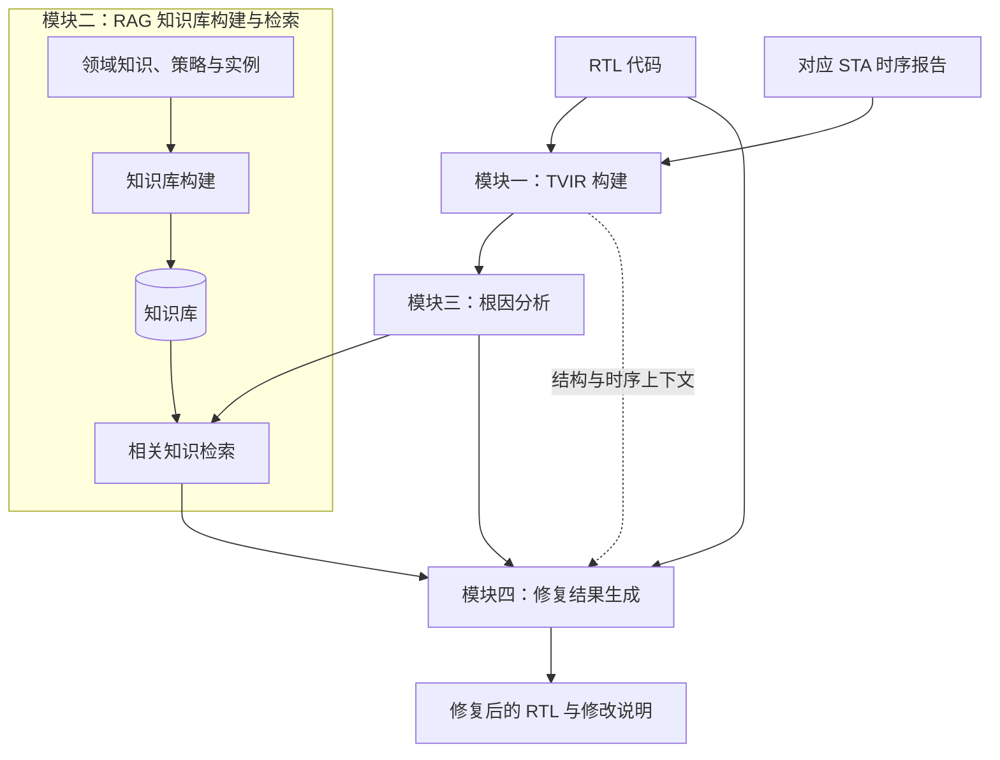

# 方法模块与关系

更新日期：2026-09-24。

本文记录当前讨论确认的方法输入、四个核心模块及其关系，作为后续基础版开发规划的依据。TVIR 的具体定义、模块接口和开发顺序将在后续讨论中细化；本文不将旧版代码的已有实现直接视为完整的方法实现。

## 1. 方法输入与输出

**方法输入：RTL 代码 + 与该版本 RTL 对应的 STA 时序报告。**

RTL 提供信号、表达式、控制条件及寄存器等代码结构；STA 报告提供时序路径和违例证据。设计与时钟约束是解释时序信息、约束修复行为所需的上下文。

**方法输出：修复后的 RTL 代码及相应修改说明。**

输入报告的生成是外围准备工作。方法内部从已有 RTL 与对应报告的联合分析开始，首先构建 TVIR。生成的修复结果需要通过后续验证评价其功能和时序表现。

## 2. 四个核心模块

| 模块 | 输入 | 核心职责 | 输出 |
| --- | --- | --- | --- |
| **TVIR 构建** | RTL 代码、对应 STA 报告及必要约束上下文 | 联合解析源码结构与时序信息，将违例路径和代码中的信号、运算、控制关系对齐 | TVIR |
| **RAG 知识库构建与检索** | 构建时输入领域知识、修复策略及实例；检索时输入当前问题的描述、场景和根因信息 | 建立可检索的知识库，并针对当前问题获取相关知识 | 知识库及当前案例的检索结果 |
| **根因分析** | TVIR 及其关联的源码、约束和时序证据 | 分析违例产生的原因，定位相关代码与结构，识别问题场景 | 根因描述、问题定位、场景类别及分析依据 |
| **修复结果生成** | 原始 RTL、根因分析结果、检索知识及必要的 TVIR/约束上下文 | 根据根因和知识生成针对性的 RTL 修改 | 修复后的 RTL 与修改说明 |

这四个模块是方法层面的划分。模型调用、提示词组织、配置和文件保存属于支撑能力，不单独替代其中的核心模块。

## 3. 模块关系

**主处理链：RTL + STA → TVIR → 根因分析 → 知识引导的修复生成。**

知识库构建是可提前完成的准备过程，不需要每处理一个案例就重建。在线处理时，根据当前问题和根因分析进行检索，再将检索结果用于修复生成。

图中的模块编号用于标识方法组成，不代表开发顺序。检索知识是否还参与根因分析、是否需要多次检索，留待结合论文方法细节确认；当前关系图先记录已讨论的“根因分析后检索、知识辅助修复”主线。

## 4. 各模块需要明确的内容

### 4.1 TVIR 构建

TVIR 的核心是将 RTL 结构与 STA 中的实际时序信息关联起来。后续需先明确：

- 从 RTL 中保留哪些信号、表达式、控制和时钟关系。
- 从 STA 报告中提取哪些路径、端点、时钟及违例信息。
- 报告中的对象如何映射到 RTL 对象，怎样处理综合改名、位选择或无法匹配的情况。
- 联合表示如何表达上述关系，并为根因分析提供可追溯的证据。

旧版 STDG 可以作为实现参考，但仅有 RTL 依赖图或结构最长路径，不足以代表完成了 TVIR 构建。TVIR 的数据结构、字段和构建算法尚未在本文中定案。

### 4.2 RAG 知识库构建与检索

基础版已确认覆盖 setup、hold，暂不纳入 CDC；原始资料与查询统一英文，资料采用带来源信息的 Markdown。构建执行结构解析、递归分块、本地 Qwen3-Embedding-0.6B 编码及全量索引，使用 Qdrant 本地持久化与本地 BM25 索引。

检索提供 dense、bm25、hybrid 三种模式，默认以 RRF 融合两路候选并返回前 5 个片段。模块通过 Python 接口和命令行独立使用，返回原文、来源和排名；不生成修复代码，也不把文本相关性当作策略适用性的证明。

具体数据、分块边界、构建失败保护、检索规则及验收标准见 [RAG 知识库构建与独立检索 Spec](C:/Users/anwen/Desktop/tv-guider/docs/spec/rag-knowledge-base.md)。后续是否让检索辅助根因分析，以及如何由上游构造查询和判断设计约束，仍需相应模块与集成设计确定。

### 4.3 根因分析

该模块消费 TVIR，结合结构与时序证据解释违例成因。输出需要能够支持后续知识检索和修复，而不仅是一段脱离源码及报告的通用解释。

后续需明确分析步骤、模型与规则各自承担的职责、原因与源码位置的关联方式，以及输出形式。旧版提示词和场景分类器是可复用材料，不预设其等同于最终方案。

### 4.4 修复结果生成

该模块将原始设计、根因和检索知识结合，生成针对当前问题的修复结果。后续需明确修复指令如何组织、哪些功能与时序约束必须保持、输出如何提取，以及如何记录使用的知识和修改依据。

生成结果本身不代表验证通过。验证与评价可以作为外围环节接入；如果后续引入验证反馈，也应另行定义迭代关系。

## 5. 已确认的基础版起点

- 基础版问题范围为 **setup、hold**，暂不纳入 CDC；先开发并验收独立的 RAG 知识库构建与检索能力。
- 后续生成类大模型调用优先使用 **DeepSeek**；RAG embedding 已确定为本地 **Qwen3-Embedding-0.6B**。
- 旧版代码和实验材料保留在 `legacy/`，作为参考与迁移来源。

RAG 已有独立 Spec。其余模块的具体案例、TVIR 定义、接口与验收方式仍待讨论，RAG 检索通过不能代表整个方法主链或最终 RTL 修复验证通过。

## 6. 相关记录

- [RAG 知识库构建与独立检索 Spec](C:/Users/anwen/Desktop/tv-guider/docs/spec/rag-knowledge-base.md)：已确认的基础版 RAG 设计及验收要求。
- [旧版代码探索](C:/Users/anwen/Desktop/tv-guider/docs/notes/2026-09-24-codegraph-exploration.md)：记录旧版实现与验证范围，不作为新版方法规格。
- [领域术语](C:/Users/anwen/Desktop/tv-guider/CONTEXT.md)：区分结构路径、时序违例、候选修复和验证结果等概念。
- [旧版归档说明](C:/Users/anwen/Desktop/tv-guider/legacy/README.md)：说明历史材料的组成和使用方式。
